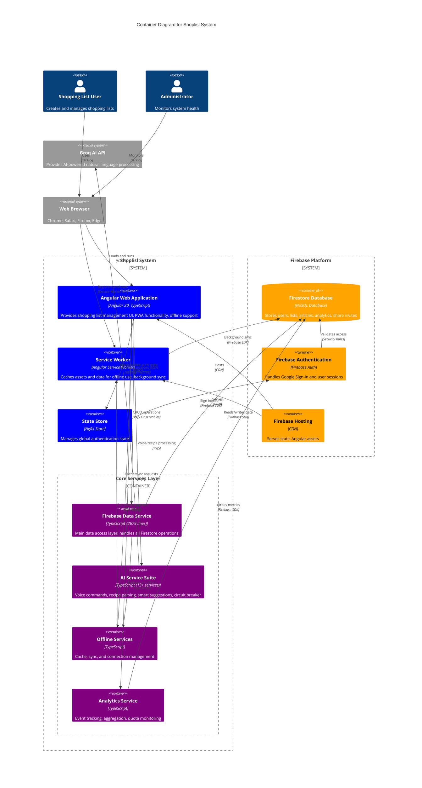

# C4 Model - Container Diagram for Shoplisl

## Overview
This diagram shows the internal structure of the Shoplisl system, breaking it down into containers (applications, data stores, etc.) and showing how they interact.

## Diagram



## Container Descriptions

### Shoplisl System Containers

#### 1. Angular Web Application
**Technology:** Angular 20, TypeScript 5.8, Angular Material 20, SCSS
**Purpose:** Main user interface and application logic

**Key Components:**
- **Features**: Lists, Articles, Shops, Admin, Help modules
- **Shared Components**: Article lists, dialogs, navigation
- **Routing**: Lazy-loaded feature modules
- **Change Detection**: OnPush strategy for performance
- **Forms**: Reactive forms with validation

**Responsibilities:**
- Render UI with Material Design components
- Handle user interactions (click, tap, voice)
- Manage component-level state (Signals, BehaviorSubjects)
- Route navigation between features
- Display real-time updates from Firebase
- Show offline/online status

#### 2. Service Worker
**Technology:** Angular Service Worker (@angular/service-worker)
**Purpose:** Enable offline functionality and PWA features

**Capabilities:**
- Cache static assets (HTML, CSS, JS, images)
- Cache dynamic data (Firestore responses)
- Background sync when connection restored
- Push notifications (future feature)
- App shell caching strategy
- Version management and updates

**Configuration:**
- `ngsw-config.json` defines caching strategies
- Asset groups for immediate/lazy loading
- Data groups for API responses

#### 3. State Store (NgRx)
**Technology:** NgRx Store 20.1
**Purpose:** Global state management for authentication

**State Shape:**
```typescript
{
  auth: {
    user: User | null,
    isAuthenticated: boolean,
    loading: boolean,
    error: string | null
  }
}
```

**Actions:**
- `signIn()`, `signOut()`, `setUser()`, `authError()`

**Effects:**
- Listen to Firebase auth state changes
- Dispatch actions on auth events
- Handle side effects (navigation, notifications)

#### 4. Firebase Data Service
**Technology:** TypeScript (2679 lines - largest service)
**Purpose:** Central data access layer for all Firestore operations

**Key Methods:**
- **Lists**: `getLists()`, `addList()`, `updateList()`, `deleteList()`, `shareList()`
- **Articles**: `getArticles()`, `addArticle()`, `updateArticle()`, `deleteArticle()`
- **Item States**: `updateItemState()`, `checkItem()`, `uncheckItem()`
- **History**: `getCheckHistory()`, `trackCheckEvent()`
- **Share**: `createShareInvite()`, `acceptInvite()`, `unshareList()`

**Features:**
- Real-time listeners with RxJS
- Optimistic updates for responsiveness
- Error handling and retry logic
- Quota-aware operations
- Transaction support for consistency

#### 5. AI Service Suite
**Technology:** TypeScript (13+ specialized services)
**Purpose:** AI-powered features and natural language processing

**Services:**
- **ai.service**: Main orchestration
- **groq-api.service**: API communication with circuit breaker
- **recipe-processing.service**: Parse recipes into shopping lists
- **quantity-extraction.service**: Extract amounts from text
- **command-parser.service**: Natural language command parsing
- **action-executor.service**: Execute AI-interpreted actions
- **smart-suggestions.service**: Context-aware suggestions
- **circuit-breaker.service**: API failure protection (3 failures → open)
- **performance-monitor.service**: Track AI response times

**Capabilities:**
- Voice command: "Add 2 apples and 3 bananas"
- Recipe parsing: Full recipe text → ingredient list
- Smart suggestions: Based on shopping history
- Multi-item batch processing
- Siri Shortcuts integration

#### 6. Offline Services
**Technology:** TypeScript
**Purpose:** Enable full offline functionality

**Components:**
- **OfflineCacheService**: LocalStorage/IndexedDB caching
- **OfflineSyncService**: Background sync queue
- **ConnectionService**: Online/offline detection

**Offline Flow:**
1. User performs action while offline
2. Action cached locally
3. UI updates optimistically
4. Connection restored → sync queue processes
5. Conflicts resolved (last-write-wins)
6. UI updated with server state

#### 7. Analytics Service
**Technology:** TypeScript
**Purpose:** Track usage metrics and monitor Firebase quotas

**Event Types:**
- User actions (list created, article added, item checked)
- AI usage (voice command, recipe parsed)
- Performance metrics (load time, render time)
- Error tracking (API failures, offline events)

**Aggregation:**
- Daily aggregates (total events, unique users)
- User metrics (most active users, feature usage)
- AI insights (success rate, common commands)
- Quota monitoring (reads, writes, deletes per day)

**Retention:**
- Raw events: 90 days
- Daily aggregates: 365 days
- User metrics: Indefinite

### Firebase Platform Containers

#### Firestore Database
**Technology:** NoSQL Document Database
**Purpose:** Persistent data storage

**Collections:**
```
users-v2/{userId}/
  ├── articles/{articleId}        # User's private articles
  ├── lists/{listId}               # User's owned lists
  └── unshare-notifications/{id}   # Removal notifications

share-invites/{inviteId}           # Global share invitations

analytics/
  ├── events/items/{eventId}       # Raw analytics (90-day)
  ├── daily-aggregates/{date}      # Daily metrics
  ├── user-metrics/{userId}        # Per-user stats
  └── ai-insights/{date}           # AI usage insights

admin/
  ├── feature-flags/{flagId}       # Feature toggles
  ├── user-feedback/{feedbackId}   # User feedback
  └── system-alerts/{alertId}      # System notifications
```

**Security Rules:**
- Owner-based read/write
- Shared list edit permissions
- Admin-only analytics access
- Token-validated share invites

#### Firebase Authentication
**Technology:** Firebase Auth
**Purpose:** User authentication and session management

**Providers:**
- Google Sign-In (primary)
- Future: Email/password, Apple Sign-In

**Features:**
- OAuth 2.0 token management
- Session persistence
- Auto-refresh tokens
- Sign-out across devices

#### Firebase Hosting
**Technology:** Google Cloud CDN
**Purpose:** Serve static assets globally

**Deployment:**
```bash
npm run build
firebase deploy
```

**Features:**
- Global CDN distribution
- HTTPS by default
- Custom domain support (shoplisl.web.app)
- Automatic SSL certificates
- Rollback support

### External Systems

#### Groq AI API
**Endpoint:** Configured via `environment.groqApiKey`
**Protocol:** REST API over HTTPS
**Rate Limiting:** Circuit breaker protects against failures

**Request/Response:**
```typescript
// Request
{
  "text": "Add 2 apples and 3 bananas to groceries",
  "context": {
    "listId": "abc123",
    "departments": ["Produce", "Dairy"]
  }
}

// Response
{
  "items": [
    { "name": "apples", "amount": "2", "department": "Produce" },
    { "name": "bananas", "amount": "3", "department": "Produce" }
  ]
}
```

#### Web Browser
**Supported:** Chrome 90+, Safari 14+, Firefox 88+, Edge 90+
**APIs Used:**
- Service Worker API
- Cache API
- IndexedDB
- LocalStorage
- Web Share API
- Speech Recognition API (voice assistant)

## Data Flow

### Read Path (Online)
```
User → Browser → Angular App → Firebase Data Service → Firestore
    ← Observable Stream ← RxJS BehaviorSubject ← Firestore Snapshot ←
```

### Write Path (Online)
```
User → Form → Component → Firebase Data Service → Firestore
                                ↓
                          Optimistic Update
                                ↓
                         UI Updates Immediately
```

### Offline Path
```
User → Browser → Angular App → Offline Service → LocalStorage
                                     ↓
                              Optimistic Update
                                     ↓
                               UI Updates
                                     ↓
                          [Connection Restored]
                                     ↓
                             Offline Sync Service
                                     ↓
                                  Firestore
```

### AI Processing Path
```
User Voice → Web Speech API → AI Service → Groq API
                                              ↓
                                      Parsed Items
                                              ↓
                                    Action Executor
                                              ↓
                              Firebase Data Service
                                              ↓
                                          Firestore
```

## Technology Choices

### Why Angular 20?
- Mature framework with excellent TypeScript support
- Standalone components reduce bundle size
- Built-in PWA support
- OnPush change detection for performance
- Strong Material Design library

### Why NgRx?
- Predictable state management
- DevTools for debugging
- Time-travel debugging
- Middleware for effects
- Currently only used for auth (may expand)

### Why Firebase?
- Real-time sync out of the box
- Offline support built-in
- Security rules for authorization
- Free tier generous for MVP
- Easy deployment with hosting

### Why Groq AI?
- Fast inference times
- Cost-effective
- Good natural language understanding
- Simple REST API
- Alternative to OpenAI

### Why Service Worker?
- Native PWA support
- Offline-first architecture
- Background sync
- Future: Push notifications
- Installable app experience

## Performance Considerations

### Frontend Optimizations
- Lazy loading all feature modules
- OnPush change detection
- Virtual scrolling for long lists (future)
- Image lazy loading
- Bundle size tracking

### Backend Optimizations
- Firestore indexes for common queries
- Quota monitoring to prevent overages
- Disabled automatic cleanup (saved 550+ reads/day)
- Batch writes where possible
- Strategic use of real-time listeners

### Offline Optimizations
- Aggressive caching strategy
- Optimistic UI updates
- Background sync queue
- Conflict resolution
- Connection state management

## Deployment Architecture

```
Developer → Git Push → GitHub → Firebase CLI → Firebase Hosting
                                      ↓
                              Build Artifacts
                                      ↓
                                Global CDN
                                      ↓
                             User's Browser
```

**CI/CD:**
- Manual deployment currently
- Future: GitHub Actions for auto-deploy
- Environment management (dev, staging, prod)
- Automated testing before deploy

## Security Architecture

### Authentication Flow
```
User → Google Sign-In → Firebase Auth → ID Token
                                           ↓
                                   Angular App (NgRx)
                                           ↓
                                   All Firestore Requests
                                           ↓
                                  Security Rules Validate
```

### Data Access Control
```
Firestore Security Rules:
- User can read/write own data: users-v2/{userId}/**
- User can read shared lists: lists.sharedWith contains userId
- Admin can read analytics: request.auth.token.admin == true
- Share invites validated by token expiration
```

### API Security
- Groq API key stored in environment (not committed)
- Circuit breaker prevents abuse
- Rate limiting on client side
- Error messages sanitized

## Monitoring & Observability

### What's Monitored
1. **Firebase Quotas**
   - Reads, writes, deletes per day
   - Alert thresholds configurable
   - Admin dashboard visualization

2. **AI Performance**
   - Response times
   - Success/failure rates
   - Circuit breaker state
   - Common commands

3. **User Analytics**
   - Active users (DAU, MAU)
   - Feature usage
   - Error rates
   - List/article counts

4. **System Health**
   - Firestore connection status
   - Service worker update status
   - Offline sync queue size
   - Cache hit/miss rates

### Alerting (Future)
- Email/SMS on quota threshold
- Slack notifications for errors
- Performance degradation alerts
- Security anomaly detection

## Scaling Considerations

### Current Scale
- Small user base (MVP stage)
- Free Firebase tier sufficient
- No performance issues reported

### Future Scaling
- **Database**: Firestore scales automatically
- **Hosting**: CDN handles traffic spikes
- **Authentication**: Firebase Auth scales with usage
- **AI**: May need to implement queuing for high volume
- **Analytics**: Consider BigQuery export for analysis

### Bottlenecks to Watch
1. Groq API rate limits (circuit breaker helps)
2. Firebase free tier quotas (monitoring in place)
3. Client-side memory for large lists (virtual scrolling future)
4. Service worker cache size limits

## Rendering Instructions

Use the same methods as the System Context diagram:
1. **Mermaid Live Editor**: https://mermaid.live/
2. **GitHub/GitLab**: Auto-renders in markdown
3. **VS Code**: Markdown Preview Mermaid Support extension
4. **CLI**: `mmdc -i docs/c4-container-diagram.md -o output.png`
