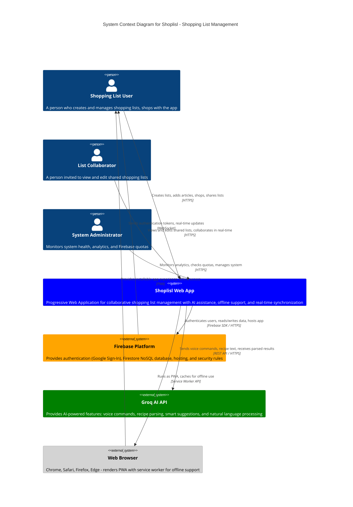

# C4 Model - System Context Diagram for Shoplisl

## Overview
This diagram shows the Shoplisl system at the highest level, depicting how it interacts with users and external systems.

## Diagram



## Key Elements

### People (Actors)

1. **Shopping List User**
   - Primary user of the system
   - Creates and manages shopping lists
   - Adds articles, organizes by departments
   - Uses the app while shopping
   - Can share lists with others

2. **List Collaborator**
   - Invited user with edit permissions
   - Accepts share invitations via token links
   - Real-time collaboration on shared lists
   - Can check/uncheck items, add articles

3. **System Administrator**
   - Monitors system health and performance
   - Tracks Firebase quota usage (critical for cost control)
   - Views analytics dashboards
   - Manages feature flags and system alerts

### Software Systems

#### Shoplisl Web App (In Scope)
**Technology Stack:**
- Frontend: Angular 20 with TypeScript 5.8
- UI: Angular Material 20, SCSS
- State: NgRx Store, RxJS, Signals
- Testing: Vitest (464 tests, 100% coverage)

**Core Features:**
- Collaborative shopping list management
- AI-powered voice assistant and recipe parsing
- Offline-first PWA with service worker
- Real-time multi-user synchronization
- 365-day check/uncheck history tracking
- Custom department ordering per list
- Token-based list sharing
- Analytics and quota monitoring

#### Firebase Platform (External)
**Services Used:**
- **Firestore**: NoSQL database for lists, articles, analytics
- **Authentication**: Google Sign-In for user authentication
- **Hosting**: Serves the Angular PWA
- **Security Rules**: Owner-based access control, share permissions

**Data Collections:**
- `users-v2/{userId}/articles` - User's private articles
- `users-v2/{userId}/lists` - User's owned lists
- `share-invites` - Global share invitation tokens
- `analytics` - Usage metrics and AI insights
- `admin` - Feature flags, feedback, alerts

#### Groq AI API (External)
**AI Capabilities:**
- Voice command parsing (natural language)
- Recipe text parsing → shopping list items
- Smart article suggestions
- Quantity extraction from text
- Multi-item batch processing
- Circuit breaker for failure protection

**Integration:**
- REST API via HTTPS
- Performance monitoring
- Configurable via environment.groqApiKey

#### Web Browser (External)
**PWA Features:**
- Service worker for offline caching
- Installable on mobile/desktop
- Push notifications support
- Background sync when reconnected
- LocalStorage/IndexedDB for offline data

## Data Flow Summary

```
User → Browser (PWA) → Shoplisl App → Firebase (Auth + Data)
                                    → Groq AI (Voice/Recipe)

Firebase → Real-time Updates → Shoplisl App → Browser → User

Offline: Browser Cache → Shoplisl App → Local Operations
         → Background Sync → Firebase (when reconnected)
```

## Key Interactions

1. **User Authentication**
   - User signs in via Google Sign-In (Firebase Auth)
   - Firebase returns auth token
   - Shoplisl validates and maintains session (NgRx Store)

2. **Real-time Collaboration**
   - User A checks item → Firebase Firestore update
   - Firebase pushes update via WebSocket
   - User B's app receives update → UI refreshes (OnPush change detection)

3. **Offline Support**
   - User goes offline → Service worker activates
   - Operations cached locally (OfflineCacheService)
   - User returns online → OfflineSyncService syncs changes
   - Conflict resolution handled by last-write-wins

4. **AI-Powered Features**
   - User speaks command → Voice AI Assistant
   - Text sent to Groq API → Parsed into structured data
   - Results processed → Articles added to list
   - Circuit breaker protects against API failures

5. **List Sharing**
   - Owner creates share invite → Token stored in Firebase
   - Owner shares URL with collaborator
   - Collaborator accepts → Added to `sharedWith[]` array
   - Real-time sync for all participants

## Security Boundaries

- **Authentication**: All requests require Firebase auth token
- **Authorization**: Firestore security rules enforce owner/shared access
- **Data Isolation**: Each user has private namespace (`users-v2/{userId}`)
- **Share Permissions**: Edit-only (no view-only mode currently)
- **Admin Access**: Analytics restricted to admin users only

## Rendering the Diagram

### Online Viewers
1. **Mermaid Live Editor**: https://mermaid.live/
   - Paste the code above
   - Export as PNG/SVG

2. **GitHub/GitLab**
   - Automatically renders in markdown files

3. **VS Code**
   - Install "Markdown Preview Mermaid Support" extension
   - Preview this file

### Command Line
```bash
# Install mermaid-cli
npm install -g @mermaid-js/mermaid-cli

# Generate PNG
mmdc -i docs/c4-system-context.md -o docs/c4-system-context.png

# Generate SVG
mmdc -i docs/c4-system-context.md -o docs/c4-system-context.svg
```

### Documentation Tools
- **Docusaurus**: Built-in Mermaid support
- **MkDocs**: Use `mkdocs-mermaid2-plugin`
- **Confluence**: Use Mermaid macro
- **Notion**: Use code block with mermaid type

## Notes

- This is a **System Context** (Level 1) C4 diagram
- For more detailed views, see:
  - Container diagram (Level 2) - Shows Angular app, Firebase services separately
  - Component diagram (Level 3) - Shows internal modules (Lists, Articles, AI, etc.)
  - Code diagram (Level 4) - Shows class relationships

## Maintenance

Update this diagram when:
- Adding new external system integrations
- Changing authentication providers
- Adding new user types/personas
- Modifying core system boundaries
